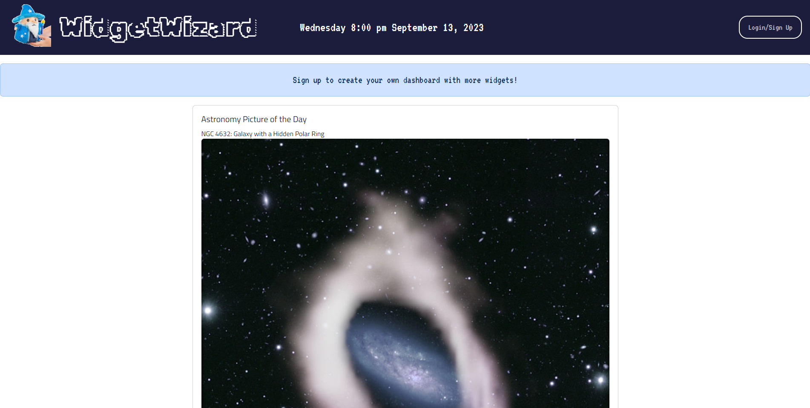
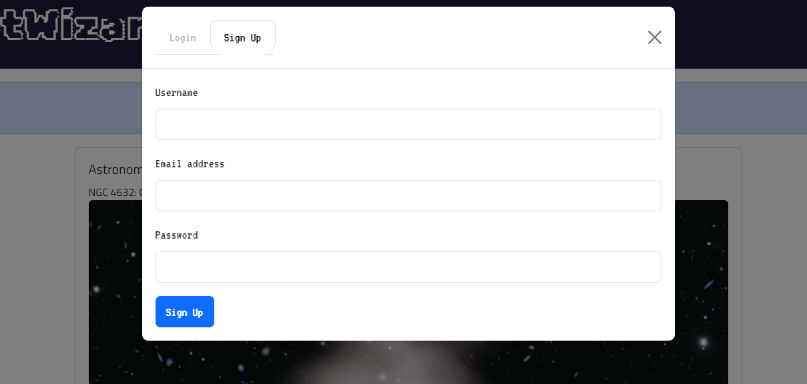
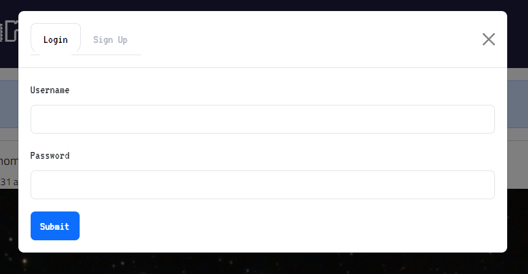
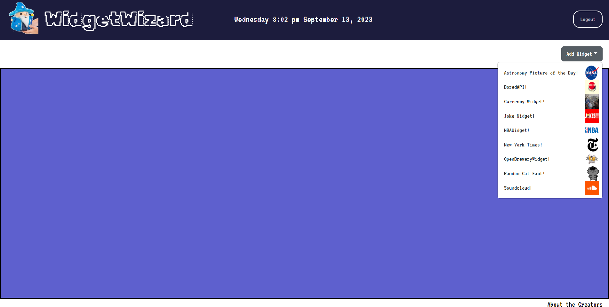
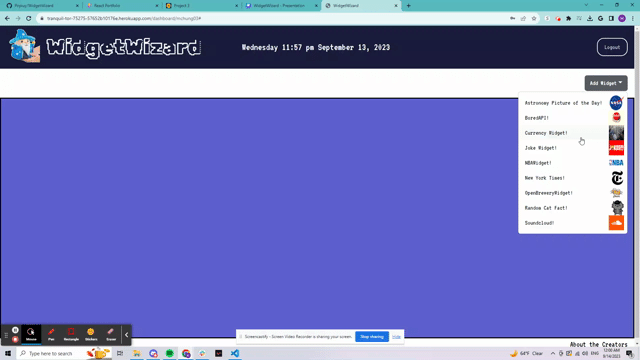
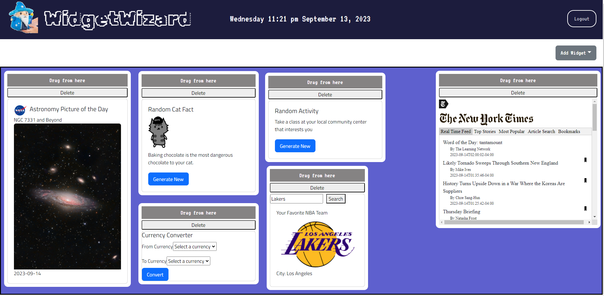
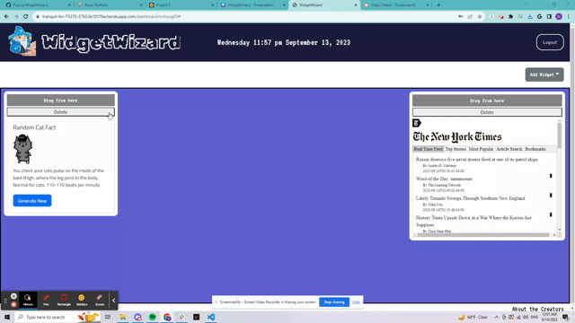
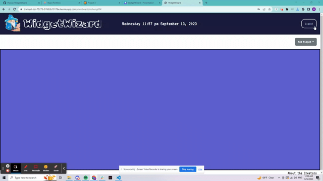

# Widget Wizard
  

## Table of Content
  * [Description](#description)
  * [Website](#website)
  * [Usage](#usage)
  * [Technologies Used](#technologies-used)
  * [Authors](#authors)
  * [Credit](#credit)

## Description
  WidgetWizard allows users to create an account to login and build a customizable dashboard with their favorite widgets, provided a diverse dropdown list of widgets to choose from. The project was built using the MERN stack.

## Website
  [CLICK HERE](https://tranquil-tor-75275-57652b10176e.herokuapp.com/) to access the deployed application.

## Usage

### Demo

When I enter the [homepage](https://tranquil-tor-75275-57652b10176e.herokuapp.com/), I am presented with a user friendly interface, with a nicely styled logo and pallete, an alert to create an account, a 'Login/Sign Up' button, a default widget "Astronomy Picture of the Day" and a footer to access information about the developers.

When I click on the 'Login/Sign Up' button, I am presented with a modal with a tab to login or sign up. To sign up I need to input my username, email, and password. To login, I need to enter is the created username and password. Then I press sign up or login and it will redirect me to the dashboard page.

When I login for the first time, I am presented with an empty dashboard and a 'Add Widget' button that opens a drop-down menu that displays a diverse list of widgets that I can click to add to my dashboard.

When I select a widget, it will be displayed on my dashboard and I can drag the widget using 'Drag from here' and position the widget anywhere I would like within the dashboard.

I am allowed to add as many widgets as I would like to, but each widget can be added only once and the widgets added will be saved even upon refresh.

When I no longer want a widget on my dashboard, I can click the 'Delete' button in its card to delete it.

When I am in my dashboard page, I can click the Logout button if I want to sign out and it will redirect me to the home page.

## Technologies Used
  - Javascript
  - HTML/CSS
  - Fetch
  - Bootstrap
  - Google Slides (wireframe)
  - Google Fonts
  - React
  - Vite
  - Node
  - Express
  - User Authentication - bcrypt
  - GraphQL
  - Apollo Server
  - MongoDB

  ### JavaScript Libraries
  * SweetAlert2: https://sweetalert2.github.io/
  * Draggable: https://shopify.github.io/draggable/examples/drag-events.html
  * Dayjs: https://day.js.org/

  ### APIs
  * Astronomy Picture of The Day: https://api.nasa.gov/
  * Bored: https://www.boredapi.com/ 
  * Breweries: https://www.openbrewerydb.org/
  * Cat Facts: https://github.com/wh-iterabb-it/meowfacts 
  * Currency Converter: https://rapidapi.com/natkapral/api/currency-converter5
  * Jokes: https://jokeapi.dev/
  * NBA: https://rapidapi.com/api-sports/api/api-nba/
  * New York Times: https://api.nytimes.com/
  * Soundcloud: https://api.soundcloud.com/

## Authors
 ### Justin Choi
  * GitHub URL: https://github.com/justinschoi93
  * LinkedIn URL: https://www.linkedin.com/in/justinschoi93/
  * E-mail address: justinschoi93@gmail.com 

 ### Minhee Chung
  * GitHub URL: https://github.com/mchung03
  * LinkedIn URL: https://www.linkedin.com/in/minhee-chung/
  * E-mail address: minhee.chung14@gmail.com

 ### Ryan Payne
  * GitHub URL: https://github.com/Popiuy
  * LinkedIn URL: https://www.linkedin.com/in/ryan-payne-218378280/
  * E-mail address: rymaxpayne@gmail.com

 ### Virginia Freitas
  * GitHub URL: https://github.com/virginiafreitas
  * LinkedIn URL: https://www.linkedin.com/in/virginia-freitas/
  * E-mail address: virginiacdefreitas@gmail.com

## Credit
  We have received advice from the UC Berkeley Extension tutors Joem Casusi, James Harding and Kyle Vance on debugging our code. We also referenced the official documentation of most of the technologies listed above.